# Support

Support is an HTB Windows machine classified as Easy.

*******1 Service Enumeration*******

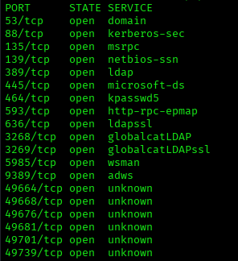

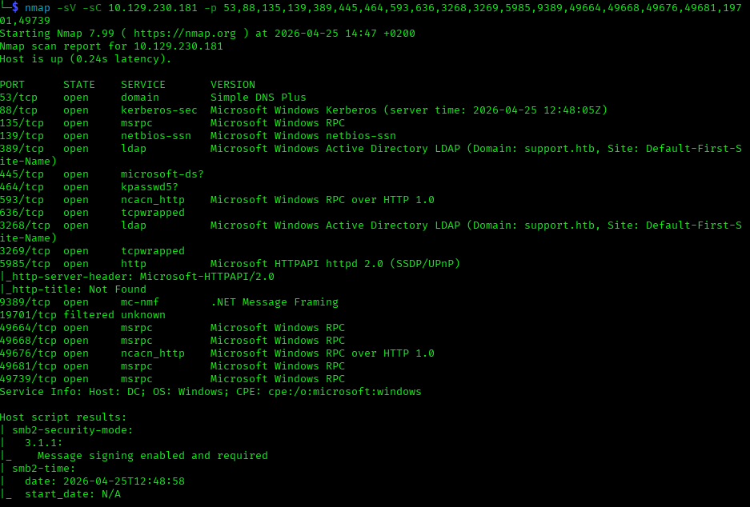

From the running services we can say that this is a domain controller.

*******2 Foothold*******

Enumerating the SMB shares I found a interesting zip file *UserInfo.exe.zip* in the *support-tools* share:

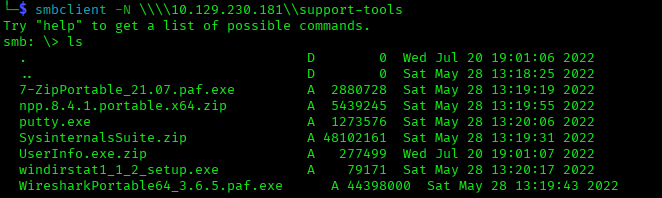

So I downloaded it, extracted the content and started enumerating the resulting files with *strings*.
Examining *UserInfo.exe* with *strings* we can see that is a .NET file and it contains strings like 'enc_password'.
.NET executables compile to Intermediate Language (IL) / CIL bytecode, not native machine code.
This make possible to decompile and reverse engineer them with specialized tools. I used *ilspycmd* to do that:

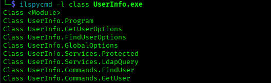

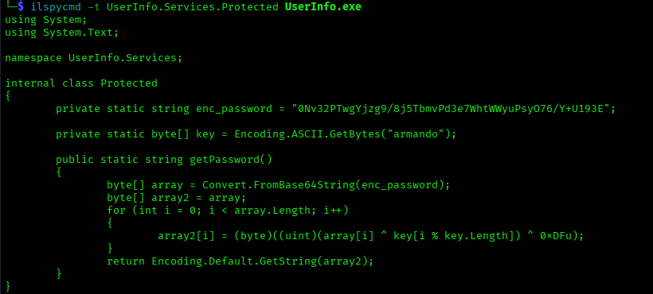

As we can see in the class is contained the logic to decode an encrypted password.
So I made the AI generate a script to copy this logic:

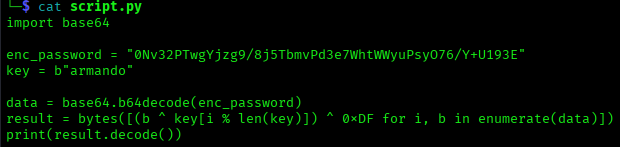

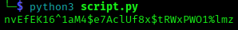

Once I found the password I retrieved the list of users with rid-brute and then sprayed to retrieve the pair:

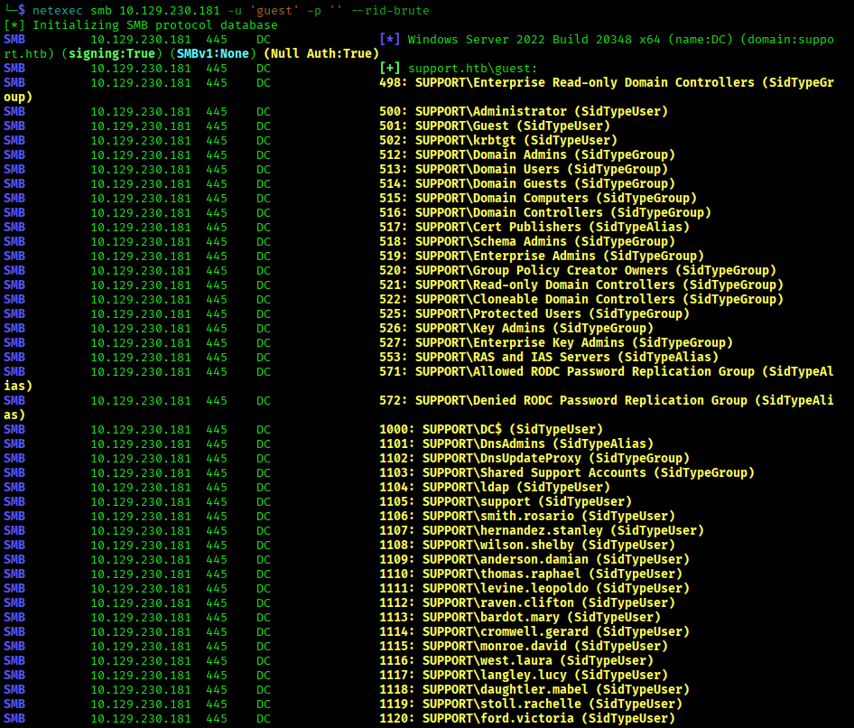

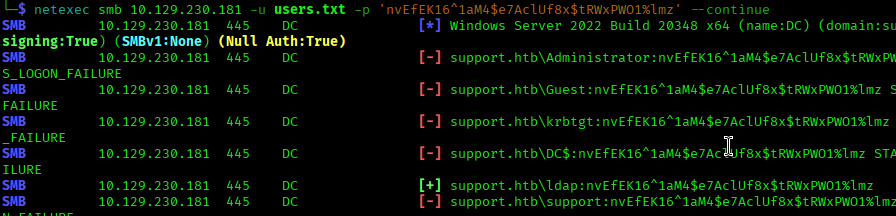

So the password belongs to the *ldap* user. We don't have command execution yet as this user cannot access remotely.
But we can use the credentials to run authenticated ldap queries:

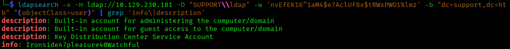

We found a new password, let's spray again, (we could have avoided spraying a second time querying also samaccountname with ldap):

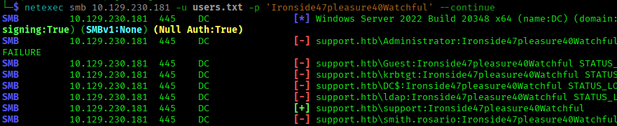

Now we have the credentials for the support user, and command execution:

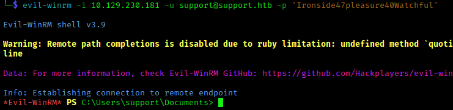

*******3 Privilege Escalation*******
The first thing I did now was to check the user characteristics:

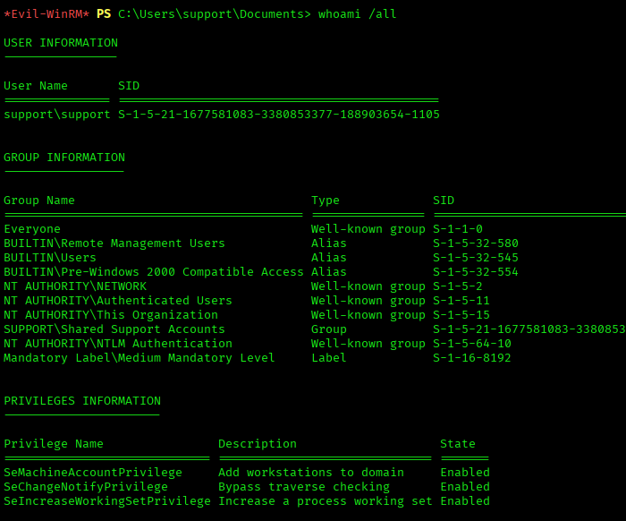

The user had the privilege to add machines to the domain. This can be abused for privilege escalation through Resource-Based Constrained Delegation (RBCD) if the user also has write permissions over a target computer object in Active Directory. So in this case we should check if the user has write permission on the *dc*. I tried to query ACL using the user SID, but that didn't give any results. So I tried to query for ACL related to the *dc* computer object.

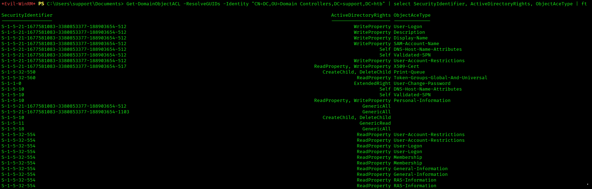

We can see that an object with RID 1103 has *GenericAll* permission over the *dc* computer object. Since objects with RID > 1000 are generally user defined we should inspect what this object is.
I tried to look up the groups which our user is a member of and as we can see the group *Shared Support Accounts* is the object we were searching for. 

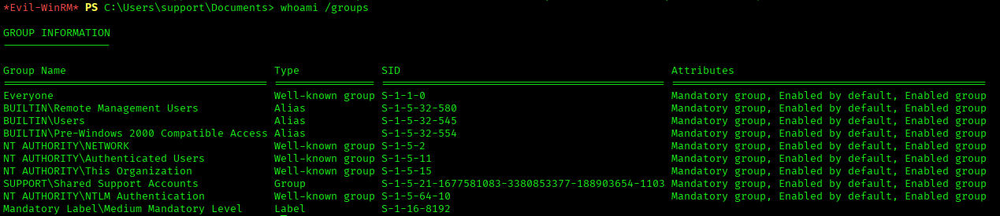

So our user has *GenericAll* permission over the DC computer account, inherited through group membership. Thanks to this permission we can write the *msDS-AllowedToActOnBehalfOfOtherIdentity* of the DC computer object. Now I created a fake computer account using the privilege of our user:

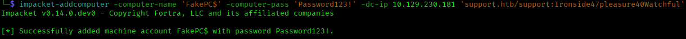

Then, I used GenericAll to write msDS-AllowedToActOnBehalfOfOtherIdentity on the DC, pointing it to your fake computer:

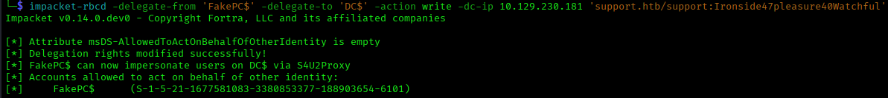

Then, I requested a kerberos TGS for the DC's Administrator, using the fake computer's credentials:

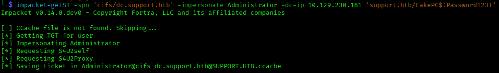

Then, after addying the TGS to the current session we can use it for kerberos authentication on the DC as Administrator (psexec drops automatically a system shell):

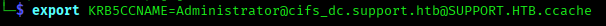

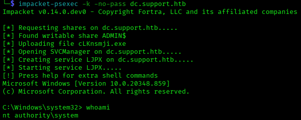

