# Retro

## 0 Information

Retro is an HTB Windows machine classified as Easy.

Notable Topics:
  - SMB Shares
  - Pre-created Computer accounts
  - Vulnerable certificate templates - ESC1

## 1 Service Enumeration

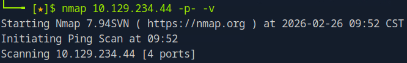

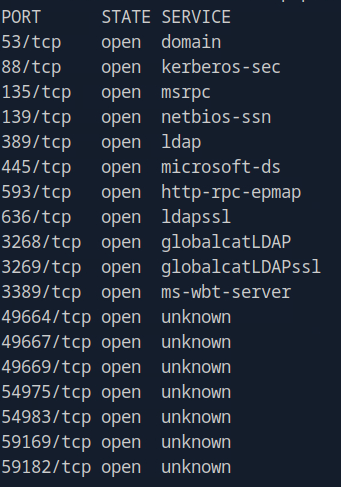

From the running services we can say that this is very likely a domain controller.

## 2 Foothold

SMB is the service with the greatest attack surface so I checked for guest access:

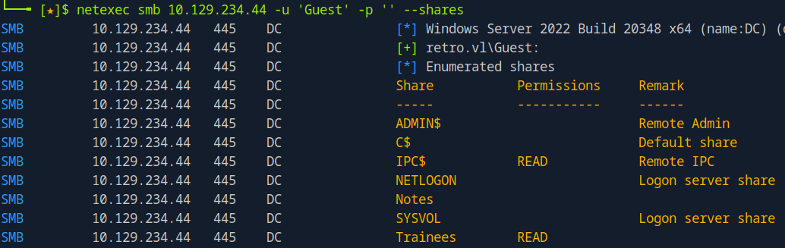

We see that the *Guest* user has access to the *Trainees* share. I read the file contained in the share:

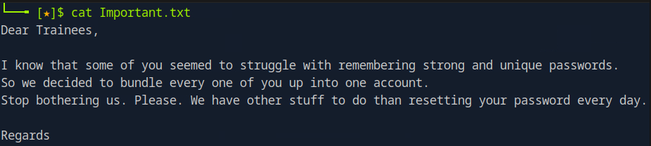

The file content suggests that the same account is created for all the trainees, this could also mean weak credentials. After that I used the *rid-brute* *netexec* module to enumerate users:

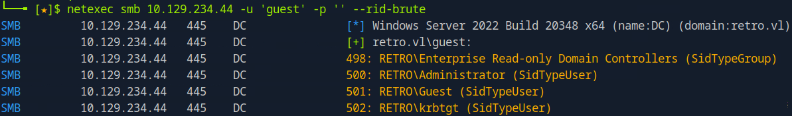

As the result of this enumeration we find the users and the *trainee* user among them. As next step I tried various weak passwords for this user:

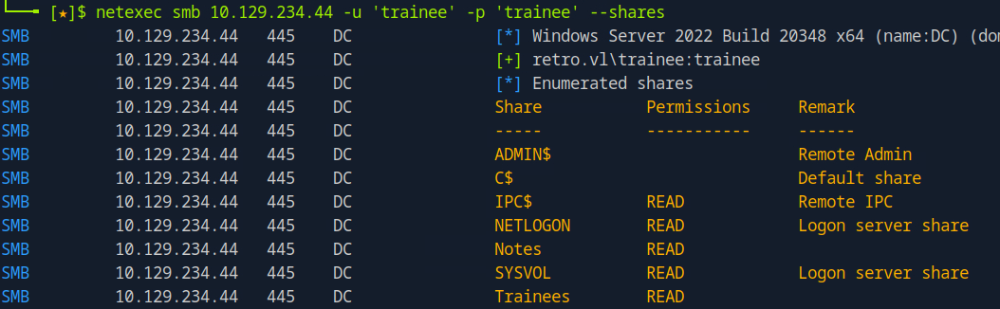

We can see that now we have gained access to the *Notes* share. Here we find the file with the following content:

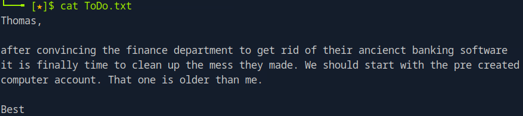

The note suggests that there is a *Pre-created computer account* on the system (possibly related to the banking service, indeed we can see that from the *ridbrute* attempt we identified the *RETRO\\BANKING$* account). 
At this point I started searching on internet for articles on pre-created computer accounts. 
I found this [blog post](https://www.trustedsec.com/blog/diving-into-pre-created-computer-accounts) which has all the information we need.
In some cases computer accounts are pre-created with the password equal to the account name, in lower case.
We can identify them from the error message in the login attempt.
Trying to login as *RETRO\\BANKING$:banking* we obtain this error message.

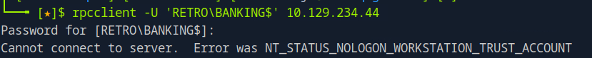

Trying another password we get this other error message instead:

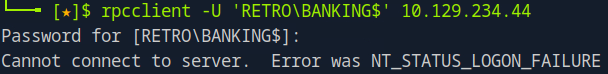

Following the content of the blog post obtaining *STATUS_NOLOGON_WORKSTATION_TRUST_ACCOUNT* means that we spot the correct password for a computer account which has not been used yet.

So at this point I tried to change its password:

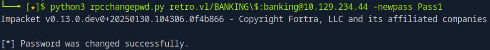

We can see now that authentication works for the computer account:

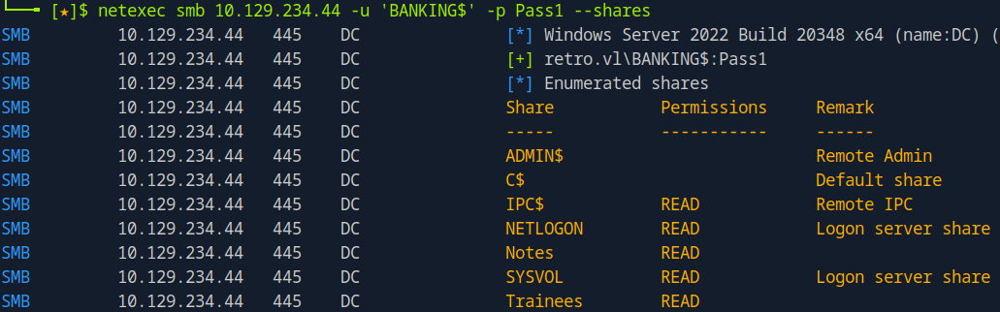

## 3 Privilege Escalation

At this point however we don't have command execution on the target yet. 
To proceed we have to enumerate the PKI (Public Key Infrastructure) service, the service which handles certificates in an AD environment.
We can do that with a ldap query:

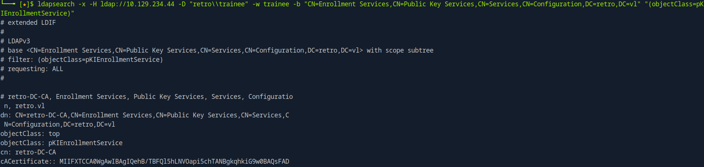

The output gives the CN (Common Name) of the CA (Certificate Authority) and a list of Certificate Templates.

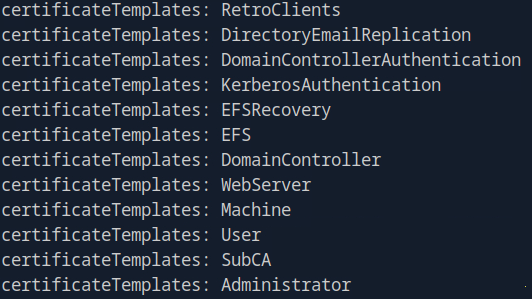

These certificate templates are used by the CA when a domain account or machine asks for a certificate to access a service.
A misconfiguration in a certificate template can lead to privilege escalation.
I used the certipy tool to find vulnerable certificate templates:

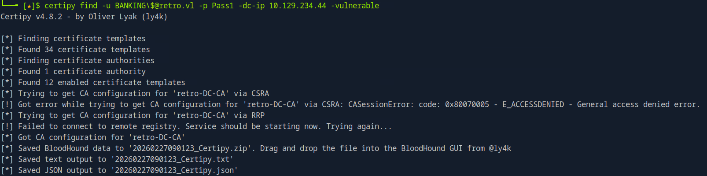

*Note that we needed RETRO/BANKING$ to perform this step.*
Reading the generated json file we can see this:

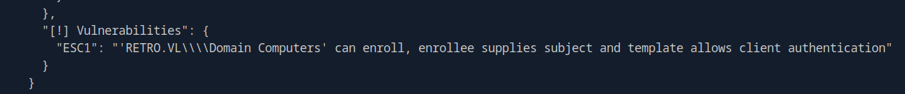

ESC1 is a privilege escalation path that exists when a certificate template allows enrollees to specify a Subject Alternative Name (SAN) while also having client authentication enabled.
Using certipy again I requested a certificate from the vulnerable template for the *Administrator* user.

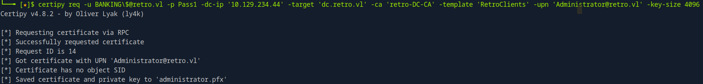

Then using the certipy ldap_shell functionality we can change the Administrator's password:

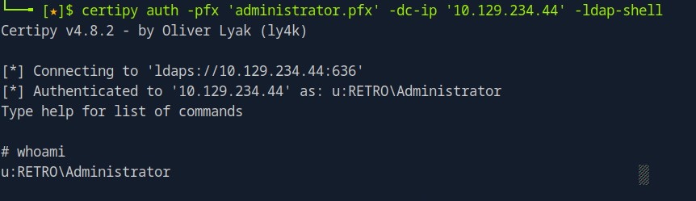

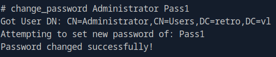

After that we can authenticate as *Administrator*:

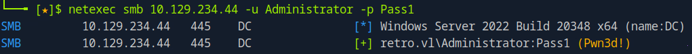

## 4 Remediation
- Disable the SMB and RPC Null and Guest sessions.
- Remove unused users/computer accounts
- Assess the security of certificate templates
